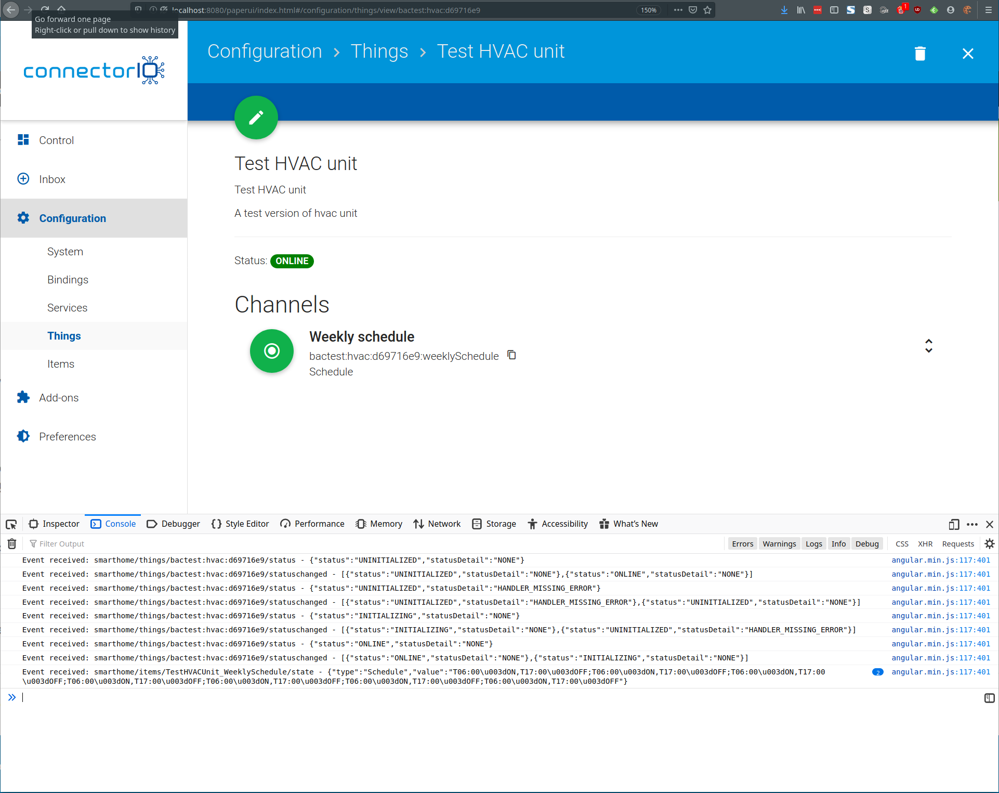

# openHAB Schedule Type



This repository contains example code making it possible to define things `Schedule` type within openHAB framework.
Notice type of the Channel (below "Weekly schedule") and event in console with formatted text and non-core type.

Bill of materials:
1. [api](api/) - the [`TypeAndStateParser`](api/src/main/java/com/connectorio/bmshub/api/TypeAndStateParser.java) interface interfered from openHAB Core `TypeParser` utility class.
2. [core](core/) - replacement of openHAB core which allows handling of new types. It swaps original 
`TypeParser` to [`DefaultTypeParser`](core/src/main/java/org/eclipse/smarthome/core/types/DefaultTypeParser.java)
with [version backed](core/src/main/java/org/eclipse/smarthome/core/types/TypeParser.java) by
[`TypeParserDelegate`](core/src/main/java/org/eclipse/smarthome/core/types/TypeParserDelegate.java).
additionally it solves troubles with
[`ItemEventFactory`](core/src/main/java/org/eclipse/smarthome/core/items/events/ItemEventFactory.java)
cause it rely on hardcoded types.

3. [schedule](schedule/) - binding utilizing (and providing) custom types:
 - [`ListType`](schedule/src/main/java/com/connectorio/bmshub/schedule/type/ListType.java) - a variable length container structure 
 - [`PairType`](schedule/src/main/java/com/connectorio/bmshub/schedule/type/PairType.java)- tuple of two types, a pair
 - [`TimeType`](schedule/src/main/java/com/connectorio/bmshub/schedule/type/TimeType.java) - basic time of the day structure representing a `LocalTime`
 - [`ScheduleType`](schedule/src/main/java/com/connectorio/bmshub/schedule/type/ScheduleType.java) - list of 7 lists with time-command pairs representing 7 days and commands to be executed at given this time.

The schedule module brings couple of more elements:
1. [`ScheduleItem`](schedule/src/main/java/com/connectorio/bmshub/schedule/ScheduleItem.java)
2. [`ScheduleItemFactory`](schedule/src/main/java/com/connectorio/bmshub/schedule/ScheduleItemFactory.java)
3. [`ScheduleTypeAndStateParser`](schedule/src/main/java/com/connectorio/bmshub/schedule/ScheduleTypeAndStateParser.java)

Above are necessary to actually provide necessary inputs for framework. There is not yet DTO and mapping, yet it does not blow up
entire system.

This code was mostly developed in late 2018 without a major discussion behind.
It was working with Eclipse SmartHome and been ported now (January 2020) to also work with openhab-core. 

## Installation
Build this code and then install `api` module in runtime.

```shell script
install file:/home/splatch/projects/openhab-schedule/api/target/api-0.10.0-SNAPSHOT.jar
```

Then determine openhab core bundle id:
```shell script
openhab> la -s|grep org.openhab.core
133 x Active   x  80 x 2.5.0                  x org.openhab.core
```
and replace it with provisioned `core`,
```shell script
update 133 file:/home/splatch/projects/openhab-schedule/core/target/core-0.10.0-SNAPSHOT.jar
```

Finally install `schedule` type and sample binding:
 ```shell script
install file:/home/splatch/projects/openhab-schedule/schedule/target/schedule-0.10.0-SNAPSHOT.jar
```

## Disclaimer
This is an experiment, not intended for production use.
Code which was copied is brought for research purposes.

## License
The license of the code is a mixture of - Eclipse Public License v2 and "don't try it at home". You do it at your own risk.

## Authors
Łukasz Dywicki / [ConnectorIO](https://connectorio.com/?utm_source=github&utm_content=footerlink)